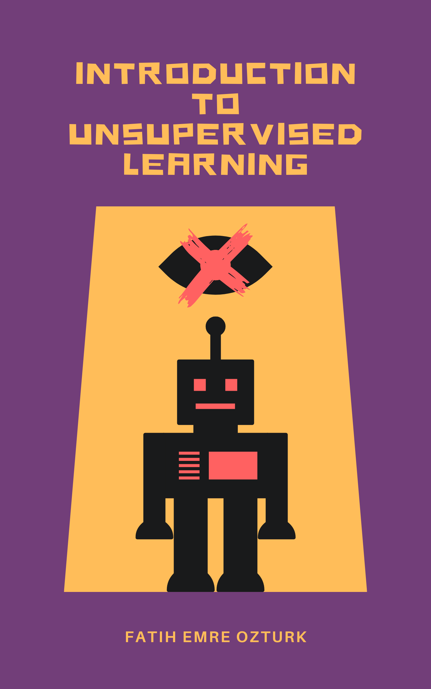

# Unsupervised Learning with feo

In this project, I covered topics that every data wizard should know about Unsupervised Learning, one of the most fundamental building blocks of machine learning.

I hope that this small booklet, which includes information about how the topics below work, how they are calculated step by step, and how they are implemented in the R programming language, will be useful for anyone interested in unsupervised learning.

**Table of Content**

1.  [What is unsupervised Learning?](https://ozturkfemre.github.io/unsupervised_learning_with_feo/#1-what-is-unsupervised-learning)
2.  [Choosing optimal number of clusters](https://ozturkfemre.github.io/unsupervised_learning_with_feo/#2-choosing-the-optimal-number-of-clusters)
3.  [k-means](https://ozturkfemre.github.io/unsupervised_learning_with_feo/#3-k-means-clustering)
4.  [k-medoids](https://ozturkfemre.github.io/unsupervised_learning_with_feo/#4-k-medoids-clustering)
5.  [Hierarchical Clustering](https://ozturkfemre.github.io/unsupervised_learning_with_feo/#5-hierarchical-clustering)
6.  [Density Based Clustering](https://ozturkfemre.github.io/unsupervised_learning_with_feo/#6-density-based-clustering)
7.  [Cluster Validation Metrics](https://ozturkfemre.github.io/unsupervised_learning_with_feo/#7-cluster-validation)
8.  [Principle Component Analysis](https://ozturkfemre.github.io/unsupervised_learning_with_feo/#8-principle-component-analysis)

You can also find cheat sheets at the end of each chapter.

You can access the booklet using [this link](https://ozturkfemre.github.io/unsupervised_learning_with_feo/).

At the end of the booklet you will find a section entitled Exercises. In this section you are expected to apply all the topics covered in this booklet using the R programming language. You can find the answer key by sending me a private message on [Linkedin](https://www.linkedin.com/in/ozturkfemre/).

May the algorithms be with you!
