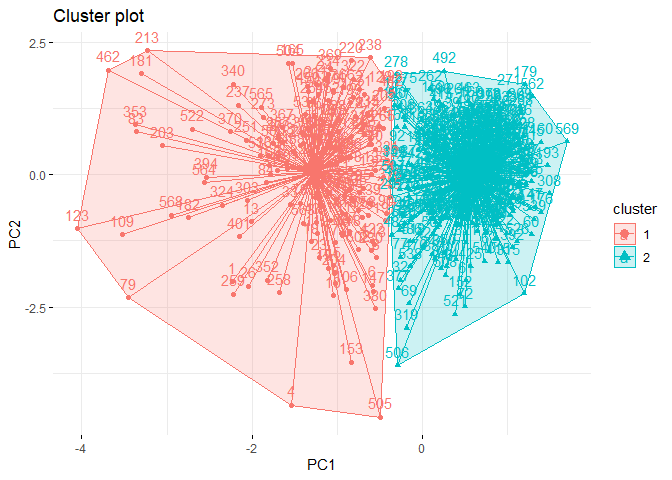
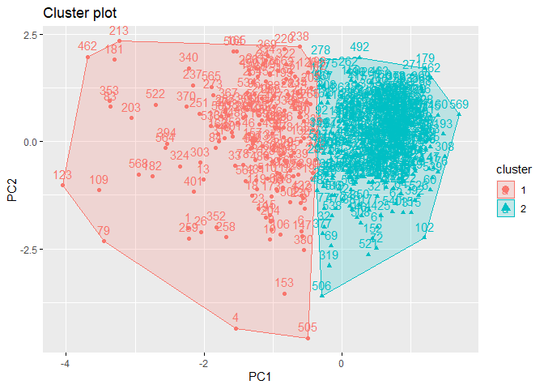
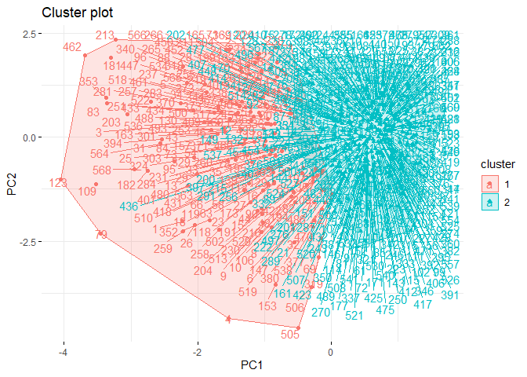
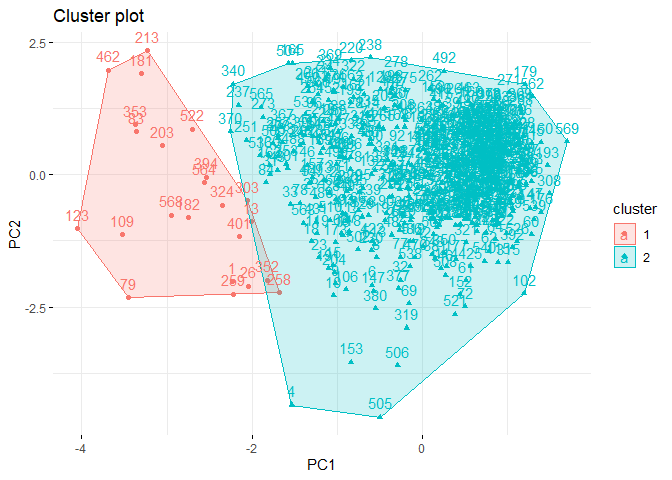
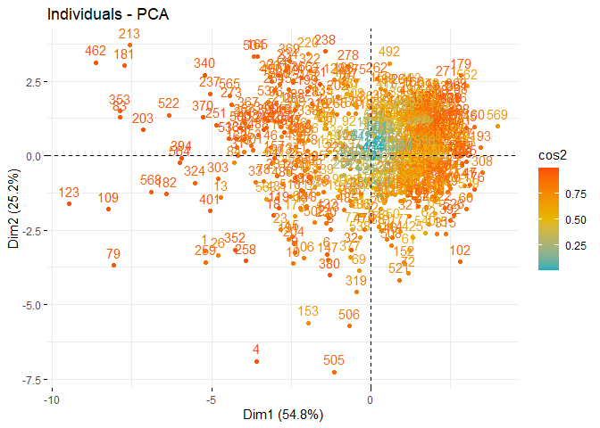
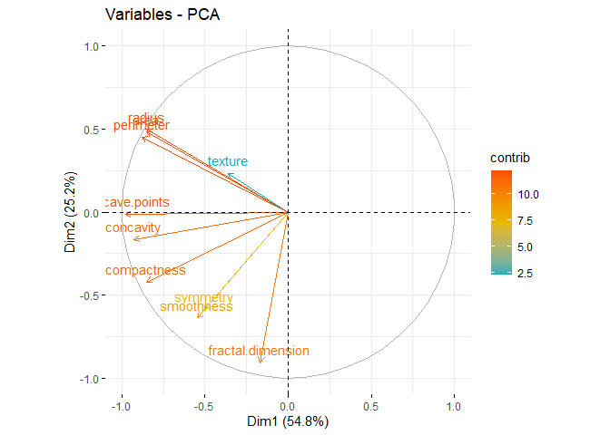

- [1. What is Unsupervised Learning?](#1-what-is-unsupervised-learning)
- [2. Choosing the Optimal Number of
  Clusters](#2-choosing-the-optimal-number-of-clusters)
  - [2.1. Elbow Method](#21-elbow-method)
  - [2.2. Average Silhouette Method](#22-average-silhouette-method)
  - [2.3. Gap Statistic](#23-gap-statistic)
  - [2.4. Calinski-Harabasz Method](#24-calinski-harabasz-method)
  - [2.5. Davies-Bouldin Method](#25-davies-bouldin-method)
  - [2.6. Dunn Index](#26-dunn-index)
  - [k determination cheat sheet](#k-determination-cheat-sheet)
- [3. k-means Clustering](#3-k-means-clustering)
  - [3.1. Data Preparation for
    k-means](#31-data-preparation-for-k-means)
  - [3.2. k-means in R](#32-k-means-in-r)
- [4. k-medoids Clustering](#4-k-medoids-clustering)
  - [4.1. k-medoids in R](#41-k-medoids-in-r)
  - [k-means and k-medoids cheat
    sheet](#k-means-and-k-medoids-cheat-sheet)
- [5. Hierarchical Clustering](#5-hierarchical-clustering)
  - [5.1. Cophenetic Distance](#51-cophenetic-distance)
  - [5.1.1. Cophenetic Distance in R](#511-cophenetic-distance-in-r)
  - [5.2. Ward’s Minimum Variance Method in
    R](#52-wards-minimum-variance-method-in-r)
  - [5.4. Average Linkage Method in R](#54-average-linkage-method-in-r)
  - [hierarchical clustering cheat
    sheet](#hierarchical-clustering-cheat-sheet)
- [6. Density Based Clustering](#6-density-based-clustering)
  - [6.1. Density Based Clustering in
    R](#61-density-based-clustering-in-r)
- [7. Cluster Validation](#7-cluster-validation)
  - [7.1. Connectivity](#71-connectivity)
    - [7.1.1. Connectivity in R](#711-connectivity-in-r)
  - [7.2. Corrected Rand Index](#72-corrected-rand-index)
    - [7.2.1. Corrected Rand Index in R](#721-corrected-rand-index-in-r)
  - [7.3. Meila’s Variation of
    Information](#73-meilas-variation-of-information)
    - [7.3.1. Meila’s Variation of Information in
      R](#731-meilas-variation-of-information-in-r)
  - [7.4. Silhouette Coefficient](#74-silhouette-coefficient)
  - [7.5. Dunn Index](#75-dunn-index)
- [8. Principle Component Analysis](#8-principle-component-analysis)
  - [8.1. Principle Component Analysis in
    R](#81-principle-component-analysis-in-r)
- [Exercises](#exercises)

# 1. What is Unsupervised Learning?

Imagine navigating through an infinite sea of data, where texts, images,
numbers, and more converge in a wild stream. This rich source of the
digital age harbors true value deep within, though it may not be
apparent at first glance. It’s like charting a course on a map in a vast
ocean of uncharted data, similar to sailing through uncharted waters
with no prior knowledge. This is where unsupervised learning comes into
play.

Unsupervised learning is the art of uncovering the hidden secrets within
the world of data. Instead of being guided by labeled examples,
unsupervised learning algorithms delve into the depths of the data ocean
to reveal underlying structures, relationships, and patterns. It’s like
giving a machine a magnifying glass and letting it discover its own
patterns and connections.

At the core of unsupervised learning are two main concepts: clustering
and dimensionality reduction. Clustering involves grouping observations
in a dataset based on their similarities. Think of it as organizing a
new bookshelf you’ve just acquired. You know you need to put the books
from your desk and the tables around the house into it, but how do you
determine where each book goes on the shelf, and what order they should
be in? The books by authors like Asimov and Herbert, who write science
fiction, can be grouped together due to their similarity. On the other
hand, authors like Joyce and Camus, who are considered classics, can be
put in a separate cluster. In essence, you’ve created two clusters:
classic literature and science fiction books. This clustering technique,
like the one I’ve mentioned, is incredibly useful in various fields,
from customer segmentation in marketing to identifying subtypes of
diseases in healthcare.

Dimensionality reduction, on the other hand, involves simplifying
complex data by reducing the number of features or dimensions. Imagine a
detailed picture; dimensionality reduction helps create a simpler,
abstract representation that preserves the essence of the original. It’s
important to remember that every task we assign to machines comes with a
cost, just like a task at work or a school assignment. Tasks that are
simpler require less time, effort, and potentially much more.
Dimensionality reduction accomplishes exactly that. A reduced dataset
allows the machine to work with less strain and lower costs. Plus, it’s
not just about the cost; it’s also about the possibilities. Data
visualization is limited to three dimensions. Beyond that, visualizing
datasets with more variables is impossible. However, if you reduce a
15-variable dataset to two variables, it becomes visually representable.
Taking all these aspects into account, dimensionality reduction acts as
the benevolent algorithm wizard, saving us from the curse of high
dimensionality.

In the rest of this book, we’ll explore various clustering algorithms
and learn how Principal Component Analysis (PCA), a dimensionality
reduction technique, works. We’ll see how it’s calculated step by step
and how to implement it in R. You can also test and reinforce what
you’ve learned with the exercises at the end of the book. Keep in mind
that machine learning is like an iceberg; teaching is what’s visible,
learning is the hidden part of the iceberg. If you don’t practice what
you’ve learned with various datasets, you’ll essentially learn nothing.
Considering all of this, I hope this book will be beneficial for you.

# 2. Choosing the Optimal Number of Clusters

When encountering a title like this, you might wonder why determining
the number of clusters is important. Let’s recall the example of the
bookshelf from the previous section. We separated the books in the
bookshelf into two clusters: classic literature and science fiction
books. However, how did we decide that there were only two clusters? Can
we be truly certain that two clusters are the correct number? In fact,
the example was manageable because we only had six books. What if we had
a million books to deal with? Determining the number of clusters can be
feasible in some cases but challenging in others. Visualizing this with
a dataset can be enlightening. For example, when you look at the
distribution graph below, you can determine that there are three
clusters because observations are concentrated around three distinct
points.

<figure>

<figcaption aria-hidden="true">Figure 2.1: an example of a data set
whose cluster number can easily be determined.</figcaption>
</figure>

However, determining the number of clusters in commonly encountered
datasets is often too complex to be achieved solely by observing the
general structure of the data with a distribution graph. For instance,
when examining the distribution graph below, it will be quite
challenging to determine how many clusters the dataset is divided into.

<figure>

<figcaption aria-hidden="true">Figure 2.2: an example of a data set
whose cluster number cannot easily be determined.</figcaption>
</figure>

Since such problems are constantly encountered, a number of methods have
been developed for the task of determining the number of clusters. In
the rest of this section we will see what six of the most used methods
are, how they are calculated step by step and how they are implemented
in R. In all of examples given, same data set ([Breast Cancer
Wisconsin](https://archive.ics.uci.edu/ml/datasets/breast+cancer+wisconsin+%28diagnostic%29))
is used.

## 2.1. Elbow Method

Elbow method is a technique used to determine the optimal number of
clusters in a cluster analysis. The idea behind it is to run clustering
algorithm on the dataset for a set number of clusters (k) and calculate
the sum of squared distances (SSE) of each point to the nearest center
for each value of k. The elbow point is the point at which the change in
the SSE starts to flatten out in the plot of the SSE versus k,
indicating that adding more clusters does not improve the model much.
\[1\], \[2\]

Elbow method can be calculated with the following steps:

1.  Determine the number of clusters, usually between 1 and 10 but can
    vary depending on the analysis.

2.  Run the desired clustering algorithm for each k value and calculate
    SSE for each k value.

3.  A line graph is drawn with each k value on the x-axis and the SSE
    values on the y-axis.

4.  The point where the SSE starts to decrease at a slower rate is the
    elbow point and the corresponding number of clusters is the optimal
    value for k.

Undoubtedly, Elbow method is one of the most widely used methods.
However, it would be wrong to say that it gives good results under all
circumstances. Sometimes it can even be said to be misleading. For this
reason, it should be emphasized that the Elbow Method should be used to
determine the number of clusters in every cluster analysis; however, it
should not be relied on this method alone.

In R, `factoextra` packages offers fancy plots for some of methods to
determine optimal number of clusters in this post. I will use
`fviz_nbclust` function to visualize elbow method for data set.

``` r
fviz_nbclust(df, # data  
             kmeans, # clustering algorithm 
             nstart = 25, # if centers is a number, how many random sets should be chosen?(default is 25)
             iter.max = 200, #  maximum number of iterations allowed.
             method = "wss") # elbow method
```

<!-- -->

For example, output above shows that there is no sharp elbow. For this
reason, it draws attention as a result open to interpretation. An
interpretation based on this elbow may therefore lead to incorrect
results.

## 2.2. Average Silhouette Method

Average silhouette method is a validity metric that measures how well a
particular observation is defined within its cluster and how well it is
separated from other clusters. It is calculated in three steps.

1.  Cluster tightness is calculated: Silhouette coefficient is computed
    by dividing the total distance of the observation being evaluated
    (highlighted in purple in the diagram below) to the other elements
    of the cluster it belongs to, by the total number of observations.
    This metric can be denoted as a(i). (Euclidean distance metric is
    commonly preferred when calculating distances.)

    <figure>
    
    <figcaption aria-hidden="true">Figure 2.3: illustration of cluster
    tightness calculation</figcaption>
    </figure>

2.  Cluster separation is calculated: the distance of the observation
    for which the silhouette coefficient is calculated to the least
    distant observation among the observations in the clusters to which
    it does not belong. We can call this metric b(i).

    <figure>
    
    <figcaption aria-hidden="true">Figure 2.4: illustration of cluster
    separation calculation</figcaption>
    </figure>

3.  Silhouette coefficient is calculated: The silhouette coefficient is
    calculated by taking the difference of b(i) from a(i) and dividing
    by the higher value of b(i) and a(i).


With the above steps, Silhouette value is calculated for each
observation in the dataset. By examining Silhouette coefficient for each
observation, we can assess how successful the clustering is for each
observation. The Silhouette coefficient, which takes values between -1
and 1, indicates that the closer the value is to 1, the more successful
the clustering result is. However, let’s remember that our priority here
is to determine the number of clusters.

To calculate validation of a clustering result, we can sum Silhouette
values for all observations and divide it by the total number of
observations in the dataset. Nevertheless, this approach contradicts our
primary objective in this section. To determine the number of clusters,
we can use Silhouette method by performing clustering for each number of
clusters within a specific range (e.g., from 2 to 10), calculating
Silhouette value for each clustering, and searching for the highest
value.

Again `fviz_nbclust` function is a way to see average silhouette plot to
decide optimal number of clusters:

``` r
fviz_nbclust(df, # data
             kmeans, # clustering algorithm
             method = "silhouette") # silhouette
```

<!-- -->

As can be easily seen from plot, clustering model with highest
silhouette value is clustering for 2 clusters. Therefore, it can be
inferred that optimal number of clusters is two. However, when
silhouette values on y-axis are examined, silhouette value for number of
clusters 3 is also quite close, although number of clusters 2 is
highest. For this reason, it would be more useful to always run
clustering algorithm for both 2 and 3 clusters and interpret results.

## 2.3. Gap Statistic

Gap is a metric that measures cluster validity by comparing the observed
within-cluster variance for different values of k with the expected
variance under a null reference distribution of the data and is
calculated in six different steps. \[5\]

1.  A range of k values between 2 and 10 is usually chosen.

2.  For each k value, the data set is clustered with the desired
    clustering algorithm and the intra-cluster variance is calculated.

3.  Reference clusters are created by randomly sampling the original
    data and the intra-cluster variance of each cluster is calculated.

4.  Gap Statistic value is obtained by taking the difference between the
    intracluster variance of the actual clusters and the intracluster
    variance of the reference clusters.

5.  Gap Statistic value is calculated separately for each k value.

6.  k value corresponding to the maximum Gap Statistic is the optimum
    number of clusters.

Again `fviz_nbclust` function is a way to see gap statistic plot to
decide optimal number of clusters:

``` r
fviz_nbclust(df, 
             kmeans ,
             nstart = 25, 
             method = "gap_stat")
```

<!-- -->

Just like Average Silhouette Method, Gap Statistic Method is also
offered 2 as optimal number of clusters.

## 2.4. Calinski-Harabasz Method

Calinski-Harabasz, also known as the Variance Ratio Criterion, is used
for cluster validity and cluster number determination, just like other
methods. The method, which can also be explained as a ratio of
inter-cluster variance and intra-cluster variance, is calculated in
three different steps\[6\].

1.  For each cluster, the average distance to the cluster center of all
    observations in that cluster is calculated. It can also be called
    WCSS

    

2.  For each cluster, the distance from the center of that cluster to
    the center of the dataset is calculated. We can call it BCSS.

    

3.  Calinski-Harabasz coefficient is calculated for each cluster using
    the formula below.

$$\frac{BCSS}{WCSS}-\frac{n-k}{k-1}$$

where,

k: total cluster number,  
n:total observation number

Calinski-Harabasz index takes values between 0 and infinity and a higher
value indicates a better clustering. For the Calinski - Harabasz method,
R does not have a visualization function like the methods I mentioned
earlier. Therefore, let’s write a function that calculates and
visualizes Calinski - Harabasz values for clusters between 2 and 10
using using `calinhara` function in `fpc` package.

``` r
library(fpc) # for calinhara function

fviz_ch <- function(data) {
  ch <- c()
  for (i in 2:10) {
    km <- kmeans(data, i) # perform clustering
    ch[i] <- calinhara(data, # data
                       km$cluster, # cluster assignments
                       cn=max(km$cluster) # total cluster number
                       )
  }
  ch <-ch[2:10]
  k <- 2:10
  plot(k, ch,xlab =  "Cluster number k",
       ylab = "Caliński - Harabasz Score",
       main = "Caliński - Harabasz Plot", cex.main=1,
       col = "dodgerblue1", cex = 0.9 ,
       lty=1 , type="o" , lwd=1, pch=4,
       bty = "l",
       las = 1, cex.axis = 0.8, tcl  = -0.2)
  abline(v=which(ch==max(ch)) + 1, lwd=1, col="red", lty="dashed")
}

fviz_ch(df)
```

<!-- -->

As other methods, Calinski — Harabasz methods is also offered 2 clusters
for data set.

## 2.5. Davies-Bouldin Method

Davies-Bouldin is a cluster validity and cluster number determination
metric that measures the similarity between clusters\[7\]. It is
calculated in three main steps as follows:

1.  For each cluster, the average distance to the cluster center of all
    observations in that cluster is calculated.

    

2.  Distance from the center of each cluster to the center of the other
    clusters is calculated.

    

3.  For each cluster, the value that is most similar to itself, i.e. the
    minimum distance between the centers, is found. The sum of the
    values of these two clusters calculated in the first step is divided
    by the distance between the centers of these two clusters. Thus, the
    most similar cluster is found for each cluster. Then, these values
    of all clusters are summed and divided by the number of clusters to
    calculate the Davies-Bouldin coefficient of that clustering.

Davies-Bouldin index takes values between 0 and infinity, with a lower
value indicating a better clustering. A value of 0 indicates that there
is no similarity between any two clusters, while a higher value
indicates a high level of similarity between some clusters.

Just like the Calinski-Harabasz method, there is no visualization
function in R for the Davies-Bouldin method. Therefore, let’s write a
function that calculates and visualizes the Davies Bouldin value for
clusters between 2 and 10 using `NbClust` function in `NbClust` package.

``` r
library(NbClust)

fviz_db <- function(data) {
  k <- c(2:10)
  nb <- NbClust(data, min.nc = 2, max.nc = 10, index = "db", method = "kmeans")
  db <- as.vector(nb$All.index)
  plot(k, db,xlab =  "Cluster number k",
       ylab = "Davies-Bouldin Score",
       main = "Davies-Bouldin Plot", cex.main=1,
       col = "dodgerblue1", cex = 0.9 ,
       lty=1 , type="o" , lwd=1, pch=4,
       bty = "l",
       las = 1, cex.axis = 0.8, tcl  = -0.2)
  abline(v=which(db==min(db)) + 1, lwd=1, col="red", lty="dashed")
}

fviz_db(df)
```

<!-- -->

Unlike other methods, Davies-Bouldin’s recommendation for the number of
clusters is 7. Although it gives different results in this data set, it
may give more reliable results in other data sets. Therefore, it would
be useful to include the Davies-Bouldin method in every clustering
analysis.

## 2.6. Dunn Index

Dunn’s index is a measure of the compactness and separation of clusters
in a cluster analysis \[8\] and is calculated in the following three
steps: \[8\]

1.  By calculating the differences between observations belonging to two
    different clusters, the closest observation in different clusters is
    calculated. This is called minimum separation.

    

2.  By calculating the distance between observations in the same
    cluster, the distance between the two most distant observations is
    calculated and this is called the maximum diameter.

    

3.  Dunn Index is calculated by dividing the minimum separation by the
    maximum diameter.

Dunn index ranges from 0 to infinity, with a higher value indicating a
better clustering solution. A value of 1 indicates that clusters are
perfectly separated and perfectly compact, while a low value indicates
that clusters are either not separated or not compact.

Just like the Calinski-Harabasz and Davies-Bouldin methods, there is no
visualization function in R for the Dunn Index. Therefore, let’s write a
function that calculates and visualizes Dunn Index values for sets from
2 to 10 using `dunn` function in `clValid` package.

``` r
library(clValid)
```

    ## Zorunlu paket yükleniyor: cluster

``` r
fviz_dunn <- function(data) {
  k <- c(2:10)
  dunnin <- c()
  for (i in 2:10) {
    dunnin[i] <- dunn(distance = dist(data), clusters = kmeans(data, i)$cluster)
  }
  dunnin <- dunnin[2:10]
  plot(k, dunnin, xlab =  "Cluster number k",
       ylab = "Dunn Index",
       main = "Dunn Plot", cex.main=1,
       col = "dodgerblue1", cex = 0.9 ,
       lty=1 , type="o" , lwd=1, pch=4,
       bty = "l",
       las = 1, cex.axis = 0.8, tcl  = -0.2)
  abline(v=which(dunnin==max(dunnin)) + 1, lwd=1, col="red", lty="dashed")
}

fviz_dunn(df)
```

<!-- -->

As Davies-Bouldin methods, Dunn also suggested different cluster number.
As I said before, each method may give different results for each data
set. For this reason, it is useful to compare all methods in each
clustering analysis.

***References for Chapter***

\[1\] Steinley, D., & Brusco, M. J. (2011). Choosing number of clusters
in Κ-means clustering. Psychological methods, 16(3), 285.

\[2\] Halkidi, Maria, Yannis Batistakis, and Michalis Vazirgiannis. “On
clustering validation techniques.” Journal of intelligent information
systems 17 (2001): 107–145.

\[3\] Rousseeuw, Peter J. Silhouettes: a graphical aid to interpretation
and validation of cluster analysis.Journal of computational and applied
mathematics, 1987, 20: 53–65.

\[4\] Halkidi, M., Batistakis, Y., & Vazirgiannis, M. (2001). On
clustering validation techniques. Journal of intelligent information
systems, 17, 107–145.

\[5\] Tibshirani, R., Walther, G., & Hastie, T. (2001). Estimating
number of clusters in a data set via gap statistic. Journal of Royal
Statistical Society: Series B (Statistical Methodology), 63(2), 411–423.

\[6\] Caliński, T., & Harabasz, J. (1974). A dendrite method for cluster
analysis. Communications in Statistics-theory and Methods, 3(1), 1–27.

\[7\] Davies, D. L., & Bouldin, D. W. (1979). A cluster separation
measure. IEEE transactions on pattern analysis and machine intelligence,
(2), 224–227.

\[8\] Dunn, J. C. (1973). A fuzzy relative of ISODATA process and its
use in detecting compact well-separated clusters.

## k determination cheat sheet

<figure>

<figcaption aria-hidden="true">k-determination-cheat-sheat</figcaption>
</figure>

---

# 3. k-means Clustering

The clusters that emerge after any cluster analysis usually contain
multiple observations. The combination of these multiple observations
forms clusters. In order for clustering algorithms to detect these
clusters, clusters need to be represented. k-means clustering algorithm
considers the cluster center as the average of all observations in that
cluster. Its main principle is to minimize the intra-cluster variance
\[1\], \[2\]. Although there are many variants of k-means, the
Hartigan-Wong algorithm, which is also included by default in k-means
functions in programming languages such as Python and R, is the most
widely preferred variant of k-means, which is also described in this
chapter. k-means clustering algorithm is a partitioning-based clustering
algorithm like k-medoids, which will be described in the next section.
Below you can see step by step, with illustrations, how k-means are
calculated. In the first illustration, let’s see what the example
dataset we will use looks like:


**Step 1:**

The number of clusters is decided. The second chapter is devoted
entirely to this topic, so if you skipped that chapter, you can come
back to it.

**Step 2:**

From the dataset, k random observations are selected as cluster centers.
This step can be illustrated as follows.


**Step 3:**

Each observation is assigned to the cluster of the cluster center
closest to it. We will start assigning each observation as follows.


At end of this step, our process will look like follows.


**Step 4:**

In the third step, after the assignment of each observation, the
observations in the clusters are averaged. These average values form the
centers of the new clusters as follows.


**Step 5:**

Repeat steps 3 and 4 until the cluster assignments no longer change or
we reach the maximum number of iterations. At the end of these
iterations our clustering will look as follows:


## 3.1. Data Preparation for k-means

In general, data preparation for a cluster analysis in unsupervised
learning should be as follows:

- Missing values in the data set should be removed or filled.

- Outliers in the data set should be removed if they need to be
  removed(!).

- The main calculation in clustering algorithms is distance calculation.
  Distance calculations can be affected by different scales. The data
  set should be standardized to avoid being negatively affected by these
  scale differences \[4\].

- Principal component analysis can help improve the performance of a
  clustering algorithm by transforming the data into a new coordinate
  system that better separates the underlying clusters. This can lead to
  more accurate and meaningful results, especially for datasets with
  complex structures. \[5\]

- Principal component analysis can be used to reduce the number of
  variables in a high-dimensional data set, which can help improve the
  performance of a clustering algorithm. By reducing the dimensionality,
  principal component analysis can also help reduce noise and eliminate
  multicollinearity in the data, making it easier to interpret the
  results of a clustering analysis\[6\].

## 3.2. k-means in R

There are many packages and functions available to implement k-means
algorithm in R. In this article, I will show you `kmeans` function in
`stats` package and `eclust` function in `factoextra` package.

We will again use [Breast Cancer
Wisconsin](https://archive.ics.uci.edu/ml/datasets/breast+cancer+wisconsin+(diagnostic))
data set from UCI Machine Learning Repository. Dataset contains various
information of tumor cells labeled as benign or malignant. There are 569
observations and 32 variables. However, some variables are averages of
other variables. Therefore, these variables were removed from the
dataset. In addition, variables related to ID and label information were
also removed. Given the high correlation and high dimensionality between
pairs of variables, principal component analysis was applied to the
dataset, this step is not included as it is not the subject of this
chapter. The last section will cover how these steps were performed.

  
In the second chapter, we tried to determine the number of clusters
using the same dataset, and we saw that most of the methods suggested 2
as the number of clusters. For this reason, the number of clusters is
assumed to be two when using k-means and other clustering algorithms.  

We do clustering with `kmeans`function and then we store clustering
result in `km_data`object. Then we print this object with
`print`function.

``` r
km_data <- kmeans(df, # data to cluster
                  2, # k, cluster number
                  nstart=25 # number of iteration
                  ) 
print(km_data)
```

    ## K-means clustering with 2 clusters of sizes 171, 398
    ## 
    ## Cluster means:
    ##         PC1         PC2
    ## 1 -3.001746  0.07482399
    ## 2  1.289695 -0.03214799
    ## 
    ## Clustering vector:
    ##   [1] 1 1 1 1 1 1 1 1 1 1 2 1 1 2 1 1 2 1 1 2 2 2 1 1 1 1 1 1 1 1 1 2 1 1 1 1 2
    ##  [38] 2 2 2 2 2 1 2 2 1 2 2 2 2 2 2 2 1 2 2 1 1 2 2 2 2 1 2 2 1 2 2 2 2 1 2 1 2
    ##  [75] 2 2 2 1 1 2 2 2 1 1 2 1 2 1 2 1 2 2 2 2 1 1 2 2 2 2 2 2 2 2 2 1 2 2 1 2 2
    ## [112] 2 1 2 2 2 2 1 1 2 2 1 1 2 2 2 2 1 1 1 2 1 1 2 1 2 2 2 1 2 2 2 2 2 2 2 1 2
    ## [149] 2 2 2 2 1 2 2 2 1 2 2 2 2 1 1 2 1 2 2 2 1 2 2 2 1 2 2 2 2 1 2 2 1 1 2 2 2
    ## [186] 2 2 2 2 2 1 2 2 2 1 2 1 1 1 2 2 1 1 1 2 2 2 2 2 2 1 2 1 1 1 2 2 2 1 1 2 2
    ## [223] 2 1 2 2 2 2 2 1 1 2 2 1 2 2 1 1 2 1 2 2 2 2 1 2 2 2 2 2 1 2 1 1 1 2 1 1 1
    ## [260] 1 1 2 1 2 1 1 2 2 2 2 2 2 1 2 2 2 2 2 2 2 1 2 1 1 2 2 2 2 2 2 2 2 2 2 2 2
    ## [297] 2 2 2 2 1 2 1 2 2 2 2 2 2 2 2 2 2 2 2 2 2 1 2 2 2 1 2 1 2 2 2 2 1 1 1 2 2
    ## [334] 2 2 1 2 1 2 1 2 2 2 1 2 2 2 2 2 2 2 1 1 2 2 2 2 2 2 2 2 2 2 2 2 1 1 2 1 1
    ## [371] 1 2 1 1 2 1 2 2 2 1 2 2 2 2 2 2 2 2 2 1 2 2 1 1 2 2 2 2 2 2 1 2 2 2 2 2 2
    ## [408] 2 1 2 2 2 2 2 2 2 2 1 2 2 2 1 2 2 2 2 2 2 2 2 1 2 1 1 2 2 2 2 2 2 2 1 2 2
    ## [445] 1 2 1 2 2 1 2 1 2 2 2 2 2 2 2 2 1 1 2 2 2 2 2 2 1 2 2 2 2 2 2 2 2 2 2 1 2
    ## [482] 2 2 2 2 2 2 1 2 2 2 2 1 2 2 2 2 2 1 1 2 1 2 1 1 2 2 2 2 1 2 2 1 2 2 2 1 1
    ## [519] 2 2 2 1 2 2 2 2 2 2 2 2 2 2 2 1 2 1 2 2 2 2 2 2 2 2 2 2 2 2 2 2 2 2 2 2 2
    ## [556] 2 2 2 2 2 2 2 1 1 1 1 2 1 2
    ## 
    ## Within cluster sum of squares by cluster:
    ## [1] 1216.540 1121.768
    ##  (between_SS / total_SS =  48.5 %)
    ## 
    ## Available components:
    ## 
    ## [1] "cluster"      "centers"      "totss"        "withinss"     "tot.withinss"
    ## [6] "betweenss"    "size"         "iter"         "ifault"

When we examine the output, we first see how many elements there are for
each cluster. There are 398 observations in the first cluster and 171
observations in the second cluster. It is possible to say that this is
unbalanced. Then we see the cluster averages section. In this section,
we see the values of the centers of each cluster. In the clustering
vector section, we see to which cluster each observation in the dataset
is assigned. Each clustering algorithm assigns cluster names in the
order 1,2,3. Since we have two clusters in this clustering analysis, we
named the clusters as 1 and 2. The last section shows the intracluster
sum of squares values for each cluster. We want these values to be close
to each other. We also obtain the explanatory power of clustering by
dividing the sum of squares between clusters by the total sum of
squares. We want it to be as high as possible. The last section shows
what information we can access with our clustering result using an
object called km_data. We can access this information by adding the \$
sign at the end of the object name. For example, by entering
km_data\$cluster, we get a vector containing information about which
cluster each observation is assigned to.  

Of course, it is quite possible to make a more detailed comment on this
output. But this is not our only option. We can visualize clustering
result with `fviz_cluster` function in `factoextra` package. Since
`factoextra` package uses `ggplot2` package for all visualizations, you
can make same changes to ggplot2 plots that you can make to graphs you
plot with `fviz_cluster` function.

``` r
library(factoextra)
fviz_cluster(km_data,# clustering result 
             data = pcadata, # data 
             ellipse.type = "convex", 
             star.plot = TRUE, 
             repel = F, 
             ggtheme = theme_minimal()
) 
```

<!-- -->

It may be possible to interpret this plot as follows:

- Separation can be observed only in PC1 dimension.

- Within sum of square of cluster 2 is much than cluster 1.

- The reason of this needs to be difference between observation numbers
  of clusters.

- There is no visible overlap between clusters.

It is also possible to cluster data with `eclust`function from
`factoextra` package.

``` r
k2m_data <- factoextra::eclust(df, # data
                               "kmeans", # clustering algorithm
                               k = 2, # cluster number
                               nstart = 25, # iteration number
                               graph = F)
k2m_data
```

    ## K-means clustering with 2 clusters of sizes 171, 398
    ## 
    ## Cluster means:
    ##         PC1         PC2
    ## 1 -3.001746  0.07482399
    ## 2  1.289695 -0.03214799
    ## 
    ## Clustering vector:
    ##   [1] 1 1 1 1 1 1 1 1 1 1 2 1 1 2 1 1 2 1 1 2 2 2 1 1 1 1 1 1 1 1 1 2 1 1 1 1 2
    ##  [38] 2 2 2 2 2 1 2 2 1 2 2 2 2 2 2 2 1 2 2 1 1 2 2 2 2 1 2 2 1 2 2 2 2 1 2 1 2
    ##  [75] 2 2 2 1 1 2 2 2 1 1 2 1 2 1 2 1 2 2 2 2 1 1 2 2 2 2 2 2 2 2 2 1 2 2 1 2 2
    ## [112] 2 1 2 2 2 2 1 1 2 2 1 1 2 2 2 2 1 1 1 2 1 1 2 1 2 2 2 1 2 2 2 2 2 2 2 1 2
    ## [149] 2 2 2 2 1 2 2 2 1 2 2 2 2 1 1 2 1 2 2 2 1 2 2 2 1 2 2 2 2 1 2 2 1 1 2 2 2
    ## [186] 2 2 2 2 2 1 2 2 2 1 2 1 1 1 2 2 1 1 1 2 2 2 2 2 2 1 2 1 1 1 2 2 2 1 1 2 2
    ## [223] 2 1 2 2 2 2 2 1 1 2 2 1 2 2 1 1 2 1 2 2 2 2 1 2 2 2 2 2 1 2 1 1 1 2 1 1 1
    ## [260] 1 1 2 1 2 1 1 2 2 2 2 2 2 1 2 2 2 2 2 2 2 1 2 1 1 2 2 2 2 2 2 2 2 2 2 2 2
    ## [297] 2 2 2 2 1 2 1 2 2 2 2 2 2 2 2 2 2 2 2 2 2 1 2 2 2 1 2 1 2 2 2 2 1 1 1 2 2
    ## [334] 2 2 1 2 1 2 1 2 2 2 1 2 2 2 2 2 2 2 1 1 2 2 2 2 2 2 2 2 2 2 2 2 1 1 2 1 1
    ## [371] 1 2 1 1 2 1 2 2 2 1 2 2 2 2 2 2 2 2 2 1 2 2 1 1 2 2 2 2 2 2 1 2 2 2 2 2 2
    ## [408] 2 1 2 2 2 2 2 2 2 2 1 2 2 2 1 2 2 2 2 2 2 2 2 1 2 1 1 2 2 2 2 2 2 2 1 2 2
    ## [445] 1 2 1 2 2 1 2 1 2 2 2 2 2 2 2 2 1 1 2 2 2 2 2 2 1 2 2 2 2 2 2 2 2 2 2 1 2
    ## [482] 2 2 2 2 2 2 1 2 2 2 2 1 2 2 2 2 2 1 1 2 1 2 1 1 2 2 2 2 1 2 2 1 2 2 2 1 1
    ## [519] 2 2 2 1 2 2 2 2 2 2 2 2 2 2 2 1 2 1 2 2 2 2 2 2 2 2 2 2 2 2 2 2 2 2 2 2 2
    ## [556] 2 2 2 2 2 2 2 1 1 1 1 2 1 2
    ## 
    ## Within cluster sum of squares by cluster:
    ## [1] 1216.540 1121.768
    ##  (between_SS / total_SS =  48.5 %)
    ## 
    ## Available components:
    ## 
    ##  [1] "cluster"      "centers"      "totss"        "withinss"     "tot.withinss"
    ##  [6] "betweenss"    "size"         "iter"         "ifault"       "silinfo"     
    ## [11] "nbclust"      "data"

If you examine output of k2m_data object, you can see that it gives
almost same output as kmeans function. There will be other information
that you can get from clustering done with `eclust` function. For
example, with `k2m_data$silinfo` you can get silhouette values for each
observation. This can help you to question validity of your clustering.
In addition, you can also plot clustering plot without the need for
`fviz_cluster` function. There are two ways to do this.

At first you can change graph argument in function as follows:

``` r
k2m_data <- factoextra::eclust(pcadata, 
                               "kmeans",
                               k = 2, 
                               nstart = 25, 
                               graph = T)
```

<!-- -->

You can also reach plot with following code:

``` r
k2m_data$clust_plot
```

<!-- -->

***References for Chapter***

\[1\] Hartigan, John A., Manchek A. Wong. Algorithm AS 136: A k-means
clustering algorithm. Journal of royal statistical society. series c
(applied statistics) 28., 100–108, 1979

\[2\] Kassambara, Alboukadel. Practical guide to cluster analysis in R:
Unsupervised machine learning. Vol. 1. Sthda, 2017.

\[3\] James, G., Witten, D., Hastie, T., & Tibshirani, R. (2013). An
introduction to statistical learning (Vol. 112, p. 18). New York:
springer.

\[4\] Kassambara, Alboukadel. Practical guide to cluster analysis in R:
Unsupervised machine learning. Vol. 1. Sthda, 2017.

\[5\] Ben-Hur, Asa, and Isabelle Guyon. Detecting stable clusters using
principal component analysis. Functional genomics. Humana press,
159–182, 2003.

\[6\] Ding, Chris, and Xiaofeng He. K-means clustering via principal
component analysis. Proceedings of twenty-first international conference
on Machine learning. 2004.

# 4. k-medoids Clustering

k-medoids clustering algorithm is a partitioning algorithm that is very
similar to k-means clustering algorithm. As you may recall from the
previous section, in the k-means clustering algorithm, each cluster is
represented by the average of its elements. In the k-medoids algorithm,
each cluster is represented by one of its elements. In other words, each
cluster is formed with one of its elements in the center. The main goal
of the k-medoids clustering algorithm, also called Partitioning Around
Medoids, is to minimize the distance between medoids and other
observations as much as possible \[1\], \[2\].  
  
Since the k-medoids algorithm is very similar to k-means, I will use the
illustrations used in k-means. However, at this point, attention should
be paid to the fourth step. Please pay attention to what is written in
the fourth step when analyzing the following steps.

**Step 1:**

The number of clusters is determined.

**Step 2:**

From the dataset, k random observations are selected as cluster centers.
This step can be illustrated as follows.


**Step 3**

Each observation is assigned to the cluster belonging to the cluster
center closest to it. We will start assigning each observation as
follows.


**Step 4**

This step is where the k-means and k-medoids algorithms diverge. In
k-means, the center is the averages, while in k-medoids the center is
chosen as the observation closest to all observations in that cluster.
In the illustration below, assume that the darker of the newly selected
asterisked points is another observation:


**Step 5**

Repeat steps 3 and 4 until the cluster assignments no longer change or
reach a maximum number of iterations.

### 4.1. k-medoids in R

There are many packages and functions available to implement the k-means
algorithm in R. In this chapter, the `pam` function in the
`cluster`package is used. We will again use [Breast Cancer
Wisconsin](https://archive.ics.uci.edu/ml/datasets/breast+cancer+wisconsin+%28diagnostic%29)
data set from the UCI Machine Learning Repository.

If you read Chapter 2, you will remember that I compared cluster number
determination methods on the same data set. All methods predominantly
suggested two cluster numbers. That is why I will cluster the data for 2
clusters. If you also read Chapter 3, you already know what is done in
the data preparation part.

We do clustering with `pam` function and then we store the clustering
result in the `pam_data` object. Then we print this object with
`print`function.

``` r
library(cluster)
pam_data <- pam(df,2)
print(pam_data)
```

    ## Medoids:
    ##       ID       PC1        PC2
    ## [1,] 499 -2.357211 0.30131315
    ## [2,] 269  1.358672 0.03762238
    ## Clustering vector:
    ##   [1] 1 1 1 1 1 1 1 1 1 1 2 1 1 1 1 1 2 1 1 2 2 2 1 1 1 1 1 1 1 1 1 2 1 1 1 1 2
    ##  [38] 2 2 2 2 2 1 2 2 1 2 1 2 2 2 2 2 1 2 2 1 1 2 2 2 2 1 2 2 1 2 2 2 2 1 2 1 2
    ##  [75] 2 1 2 1 1 2 2 1 1 1 2 1 2 1 2 1 2 1 2 2 1 1 2 2 2 2 2 2 2 2 2 1 2 2 1 2 2
    ## [112] 2 1 2 2 2 2 1 1 1 2 1 1 2 2 2 2 1 1 1 2 1 1 2 1 2 2 2 1 2 2 1 2 2 2 2 1 2
    ## [149] 2 2 2 2 1 2 2 2 1 2 2 2 2 1 1 2 1 2 2 1 1 2 2 2 1 2 2 2 2 1 2 2 1 1 2 2 2
    ## [186] 2 1 2 2 2 1 2 2 2 1 2 1 1 1 1 2 1 1 1 2 2 2 1 2 2 1 2 1 1 1 1 2 2 1 1 2 2
    ## [223] 2 1 2 2 2 2 2 1 1 2 2 1 2 2 1 1 2 1 2 2 2 2 1 2 2 2 2 2 1 2 1 1 1 2 1 1 1
    ## [260] 1 1 2 1 2 1 1 2 2 2 2 2 2 1 2 1 2 2 1 2 2 1 2 1 1 2 2 2 2 2 2 1 2 2 2 2 2
    ## [297] 2 2 2 2 1 2 1 2 2 2 2 2 2 2 2 2 2 2 2 2 2 1 2 2 2 1 2 1 2 2 2 2 1 1 1 2 2
    ## [334] 2 2 1 2 1 2 1 2 2 2 1 2 2 2 2 2 2 2 1 1 1 2 2 2 2 2 2 2 2 2 2 2 1 1 2 1 1
    ## [371] 1 2 1 1 2 1 2 2 2 1 2 2 2 2 2 2 2 2 2 1 2 2 1 1 2 2 2 2 2 2 1 2 2 2 2 2 2
    ## [408] 2 1 2 2 2 2 2 2 2 2 1 2 2 2 1 2 2 2 2 2 2 2 2 1 2 1 1 2 2 2 2 2 2 2 1 2 2
    ## [445] 1 2 1 2 2 1 2 1 2 2 2 2 2 2 2 2 1 1 2 2 2 2 2 2 1 2 2 2 2 2 2 2 2 2 2 1 2
    ## [482] 2 2 2 1 2 2 1 2 2 2 2 1 2 2 2 2 2 1 1 2 1 2 1 1 2 2 2 2 1 2 2 1 2 2 2 1 1
    ## [519] 2 2 2 1 2 2 2 2 2 2 2 2 2 2 2 1 2 1 1 2 2 2 2 2 2 2 2 2 2 2 2 2 2 2 2 2 2
    ## [556] 2 2 2 2 2 2 2 1 1 1 1 1 1 2
    ## Objective function:
    ##    build     swap 
    ## 1.806580 1.700399 
    ## 
    ## Available components:
    ##  [1] "medoids"    "id.med"     "clustering" "objective"  "isolation" 
    ##  [6] "clusinfo"   "silinfo"    "diss"       "call"       "data"

If we examine the output obtained with the print function; at first we
can access the medoid information of each cluster for both PC1 and PC2
dimensions. We notice that the center of the first cluster is the
observation with the 499th index in the dataset, while the second
cluster is the observation with the 269th index. Next, we see the
clustering vector, which contains the information to which cluster each
observation is assigned. Finally, we see the objective function. “Build”
represents the first step in the k-median calculation and “Swap”
represents the third step.  

Just as with k-means, we can use the fviz_cluster function in the
factoextra package to plot the cluster graph as follows:

``` r
library(factoextra)
fviz_cluster(pam_data,# clustering result
             data = df, # data
             ellipse.type = "convex", # type of the clusters' appearence
             repel = F, 
             ggtheme = theme_classic()
)
```

<!-- -->

According to the cluster plot, no overlap is observed. The separation
occurs only in the PC1 dimension. The variance in the first cluster
shown in red color is higher.

***References for Chapter***

\[1\] Kaufman, L., & Rousseeuw, P. (1987). Clustering by means of
medoids. Statistical Data Analysis Based on the L1-Norm and Related
Methods, Y. Dodge Ed.

\[2\] Kaufman, L., & Rousseeuw, P. J. (2009). Finding groups in data: an
introduction to cluster analysis. John Wiley & Sons

## k-means and k-medoids cheat sheet

<figure>

<figcaption
aria-hidden="true">k-means-and-k-medoids-cheat-sheet</figcaption>
</figure>

# 5. Hierarchical Clustering

Hierarchical Clustering is an algorithm in which objects are organized
in a tree-like structure of clusters, called a dendrogram. There are two
main types of hierarchical clustering: Agglomerative and Divisive.
\[1\], \[2\], \[3\] While Divisive Hierarchical Clustering considers the
dataset as a single cluster and then iteratively decomposes it into
smaller clusters based on their similarities, Agglomerative Hierarchical
Clustering considers each observation as a cluster and then iteratively
merges them into larger clusters based on their similarities. At this
point, the important part is how these merges/separations are made.
Various linkage methods have been developed for this purpose. Below you
can see the names of these linkage methods and how the linking
operations are performed:  

1.  Single linkage: Also known as the nearest-neighbor method, this
    method calculates the distance between the closest points of the two
    clusters being merged. \[4\]

    

2.  Complete linkage: Also known as the farthest-neighbor method, this
    method calculates the distance between the furthest points of the
    two clusters being merged.\[5\]

    

3.  Average linkage: This method calculates the average distance between
    all pairs of points in the two clusters being merged. \[6\]

    

4.  Ward’s Minimum Variance linkage: This method minimizes the variance
    of the distances between points within the same cluster. It merges
    the clusters that result in the smallest increase in the total sum
    of squared distances within each cluster.\[7\]

The choice of linkage method can have a significant impact on the
resulting clusters, as each method has its own strengths and weaknesses.
Therefore, it is important to carefully consider which linkage method is
most appropriate for the data and the specific problem being addressed.
In this book, two metrics which are Ward’s Minimum Variance Method and
Average linkage method is used.

## 5.1. Cophenetic Distance

In the previous sections, we mentioned that Euclidean metric is usually
used in distance metric applications. In the case of hierarchical
clustering, we can also use Cophenetic distance to decide on the
distance metric. Cophenetic distance is a measure used in hierarchical
clustering to evaluate the similarity between two observations in the
dendrogram produced by the clustering algorithm. It is defined as the
distance between two observations in the original data space at the
level where they first merge into the same cluster in the dendrogram
\[8\]. A high correlation between the cophenetic distance and the
original distance between observations in the data space indicates that
the clustering solution preserves the structure of the data well.

## 5.1.1. Cophenetic Distance in R

There are many packages and functions available to implement k-means
algorithm in R. In this article, I will show you cophenetic function in
the `stats` package. Again, the same data set, [Breast Cancer
Wisconsin](https://archive.ics.uci.edu/ml/datasets/breast+cancer+wisconsin+(diagnostic))
from the UCI Machine Learning Repositoryi is used in the analysis.

At first, we need to calculate Euclidean and Manhattan distances between
observations:

``` r
dist_euc <- dist(df, method="euclidean") # data, distance metric
dist_man <- dist(df, method="manhattan") # data, distance metric
```

Secondly, we need to hierarchically cluster data set with both distance
metric.

``` r
hc_e <- hclust(d=dist_euc, method="ward.D2")
hc_m <- hclust(d=dist_man, method="ward.D2")
```

Lastly, we need to calculate cophenetic distance for both of the
clusterings, and check the correlation coefficient between distance
metric and cophenetic distance.

``` r
# for euclidean distance
coph_e <- cophenetic(hc_e)
cor(dist_euc,coph_e)
```

    ## [1] 0.6711685

``` r
# for manhattan distance
coph_m <- cophenetic(hc_m)
cor(dist_man,coph_m)
```

    ## [1] 0.6018289

In general, a higher cophenetic correlation coefficient indicates that
the dendrogram is a more accurate representation of the pairwise
distances between the original data points. Cophenetic correlation
coefficient can range between 0 and 1, with a value of 1 indicating a
perfect fit between the dendrogram and the pairwise distances.

In this case it can be said that when the correlation between Cophenetic
and distance matrix is examined, it is observed that hierarchical
clustering with Euclidean distance gives better results. That’s why we
will continue the analysis with Euclidean distance metric.

## 5.2. Ward’s Minimum Variance Method in R

To determine the number of clusters in hierarchical clustering, we can
use methods to determine the optimal number of clusters, just as we do
with k-means and k-medoids. This is discussed in Section 2 and will not
be discussed in this section. However, it may be useful to remind that
all methods recommend 2 as the optimal number of clusters.  
  
Another way to determine the number of clusters for hierarchical
clustering is to check the dendogram and decide where to cut. However, I
personally find this method “open-ended” but I will share the codes and
the dendogram with you.  

You can use `fviz_dend` function in `factoextra` package to visualise
dendogram of a hierarchical clustering with the object you created from
hierarchical clustering with the function `hclust` from `stats` package.

``` r
hc_e <- hclust(d=dist_euc, method="ward.D2")
fviz_dend(hc_e,cex=.5) 
```

<!-- -->

According to the dendogram, it can be said that the best height value to
cut the dendogram is 35–40. This also refers to 2 clusters. Lets
hierarchically cluster the data set with 2 clusters. `cutree` function
from `stats` package can be used to do that.

``` r
grupward2 <- cutree(hc_e, k = 2)
table(grupward2) # gives observation number in each cluster
```

    ## grupward2
    ##   1   2 
    ## 180 389

``` r
grupward2 # gives cluster assignments for each observation
```

    ##   [1] 1 1 1 1 1 1 1 1 1 1 2 2 1 2 1 1 2 1 1 2 2 2 1 1 1 1 1 1 1 1 1 1 1 1 1 1 2
    ##  [38] 2 2 2 2 1 1 1 2 1 2 1 2 2 2 2 2 1 2 2 1 1 2 2 2 2 1 2 1 1 2 2 1 2 1 2 1 2
    ##  [75] 2 2 1 1 1 2 2 1 1 1 2 1 2 1 2 1 2 2 2 2 1 1 2 2 2 2 2 2 2 2 2 1 2 2 1 2 2
    ## [112] 2 1 2 2 2 2 1 1 2 2 1 1 2 2 2 2 2 1 1 2 2 2 2 1 2 2 2 1 2 2 2 2 2 2 2 1 2
    ## [149] 2 2 2 2 1 2 2 2 1 2 2 2 2 1 1 2 1 2 2 2 1 2 2 2 1 2 2 2 2 1 2 2 1 1 2 2 2
    ## [186] 2 2 2 2 2 1 2 2 1 1 2 1 2 1 2 2 2 1 1 2 2 2 2 1 2 1 2 1 1 2 1 2 2 1 1 2 2
    ## [223] 2 2 2 2 2 2 2 1 1 2 2 1 2 2 1 1 2 1 2 2 2 2 1 2 2 2 2 2 1 2 1 1 1 2 1 1 1
    ## [260] 1 1 2 1 2 1 1 2 2 2 2 2 2 1 2 2 2 2 2 2 2 1 2 1 1 2 2 2 2 2 2 2 2 2 2 2 2
    ## [297] 2 2 2 2 1 2 1 2 2 2 2 2 2 2 2 2 2 2 2 2 2 1 1 2 2 1 2 1 2 2 2 2 1 1 2 2 2
    ## [334] 2 2 1 2 1 2 1 2 2 2 1 2 2 2 2 2 2 2 1 1 2 2 2 1 2 2 2 2 2 2 2 2 1 1 2 1 1
    ## [371] 1 2 1 1 2 2 1 2 2 1 2 2 2 2 2 2 2 2 2 1 2 2 1 1 2 2 2 2 2 2 1 2 2 2 2 2 2
    ## [408] 2 1 2 2 2 2 2 2 2 2 1 2 2 2 1 2 2 2 2 2 2 2 2 1 2 1 1 2 2 2 2 2 2 2 2 2 2
    ## [445] 1 2 1 2 2 1 2 1 2 2 2 2 2 2 2 2 1 1 2 2 2 2 2 2 1 1 2 2 2 2 2 2 2 2 2 1 2
    ## [482] 2 2 2 2 1 2 1 2 2 2 2 1 2 2 2 2 2 1 1 2 1 2 1 1 1 2 2 2 1 2 2 1 2 2 2 1 1
    ## [519] 1 2 2 1 2 2 2 2 2 2 1 2 2 2 2 1 2 1 2 1 2 2 2 2 2 2 2 2 2 2 2 2 2 2 2 2 2
    ## [556] 2 2 2 2 2 2 2 1 1 1 1 2 1 2

Now, we can again visualize the dendogram. However, this time, we can
color the clusters.

``` r
fviz_dend(hc_e, # clustering result
          k = 2, # cluster number
          cex = 0.5, 
          color_labels_by_k = TRUE, 
          rect = F )
```

<!-- -->

Just as we did in the previous clustering algorithms, we can also
visualize cluster graph with `fviz_cluster` function in `factoextra`
package:

``` r
fviz_cluster(list(data = pcadata, cluster = grupward2),
             ellipse.type = "convex", 
             repel = TRUE, 
             show.clust.cent = FALSE, ggtheme = theme_minimal())
```

<!-- -->

When the cluster graph is analyzed, overlap can be observed. It can be
seen that the separation occurs only in both PC1 and PC2. While the
variance in the first cluster shown in red is high, the variance in the
second cluster shown in green is low.

## 5.4. Average Linkage Method in R

Since cophenetic distance is covered in the Ward’s Minimum Variance
Method, it will not be shared with you in this part. However, it is
necessary to state that Euclidean distance again gave the better
results. Again, you can use `fviz_dend` function in `factoextra` package
to visualise dendogram of a hierarchical clustering with the object you
created from hierarchical clustering with the function `hclust` from
stats package.

``` r
hc_e2 <- hclust(d=dist_euc, method="average")
fviz_dend(hc_e2,cex=.5) 
```

<!-- -->

As we can see from the dendogram easily, it is very different from the
Ward’s dendogram. It seems clusters are highly unbalanced with respect
to the Ward. This may cause a problem for the cluster analysis. However,
it is a beneficial example to show that linkage is highly dependent on
the data set. It is crucial to decide the best linkage method for the
data. One way to decide the linkage is to check the descriptive
statistics of the data set to see if there are outliers. Another way is
to try all of the linkage methods to see which dendogram looks fine.

Again, it is hard to interpret it from the dendogram, but we will
continue with 2 clusters. One reason is the methods to determine the
optimal number of clusters suggested cluster number to be 2. Another
reason is to compare the result with Ward’s Minimum Variance methods.

``` r
grupav2 <- cutree(hc_e2, k = 2)
grupav2
```

    ##   [1] 1 2 2 2 2 2 2 2 2 2 2 2 1 2 2 2 2 2 2 2 2 2 2 2 2 1 2 2 2 2 2 2 2 2 2 2 2
    ##  [38] 2 2 2 2 2 2 2 2 2 2 2 2 2 2 2 2 2 2 2 2 2 2 2 2 2 2 2 2 2 2 2 2 2 2 2 2 2
    ##  [75] 2 2 2 2 1 2 2 2 1 2 2 2 2 2 2 2 2 2 2 2 2 2 2 2 2 2 2 2 2 2 2 2 2 2 1 2 2
    ## [112] 2 2 2 2 2 2 2 2 2 2 2 1 2 2 2 2 2 2 2 2 2 2 2 2 2 2 2 2 2 2 2 2 2 2 2 2 2
    ## [149] 2 2 2 2 2 2 2 2 2 2 2 2 2 2 2 2 2 2 2 2 2 2 2 2 2 2 2 2 2 2 2 2 1 1 2 2 2
    ## [186] 2 2 2 2 2 2 2 2 2 2 2 2 2 2 2 2 2 1 2 2 2 2 2 2 2 2 2 1 2 2 2 2 2 2 2 2 2
    ## [223] 2 2 2 2 2 2 2 2 2 2 2 2 2 2 2 2 2 2 2 2 2 2 2 2 2 2 2 2 2 2 2 2 2 2 2 1 1
    ## [260] 2 2 2 2 2 2 2 2 2 2 2 2 2 2 2 2 2 2 2 2 2 2 2 2 2 2 2 2 2 2 2 2 2 2 2 2 2
    ## [297] 2 2 2 2 2 2 1 2 2 2 2 2 2 2 2 2 2 2 2 2 2 2 2 2 2 2 2 1 2 2 2 2 2 2 2 2 2
    ## [334] 2 2 2 2 2 2 2 2 2 2 2 2 2 2 2 2 2 2 1 1 2 2 2 2 2 2 2 2 2 2 2 2 2 2 2 2 2
    ## [371] 2 2 2 2 2 2 2 2 2 2 2 2 2 2 2 2 2 2 2 2 2 2 2 1 2 2 2 2 2 2 1 2 2 2 2 2 2
    ## [408] 2 2 2 2 2 2 2 2 2 2 2 2 2 2 2 2 2 2 2 2 2 2 2 2 2 2 2 2 2 2 2 2 2 2 2 2 2
    ## [445] 2 2 2 2 2 2 2 2 2 2 2 2 2 2 2 2 2 1 2 2 2 2 2 2 2 2 2 2 2 2 2 2 2 2 2 2 2
    ## [482] 2 2 2 2 2 2 2 2 2 2 2 2 2 2 2 2 2 2 2 2 2 2 2 2 2 2 2 2 2 2 2 2 2 2 2 2 2
    ## [519] 2 2 2 1 2 2 2 2 2 2 2 2 2 2 2 2 2 2 2 2 2 2 2 2 2 2 2 2 2 2 2 2 2 2 2 2 2
    ## [556] 2 2 2 2 2 2 2 2 1 2 2 2 1 2

``` r
table(grupav2)
```

    ## grupav2
    ##   1   2 
    ##  23 546

As we can see from the output, clusters are highly unbalanced. This
output was expected since we observe dendogram.

Again, we can again visualize the dendogram. However, this time, we can
color the clusters.

``` r
fviz_dend(hc_e2, k = 2, 
          cex = 0.5, 
          color_labels_by_k = TRUE, 
          rect = TRUE )
```

<!-- -->

Again, just as we did in the previous clustering algorithms, we can also
visualize cluster graph with `fviz_cluster` function in `factoextra`
package:

``` r
fviz_cluster(list(data = pcadata, cluster = grupav2),
             ellipse.type = "convex", 
             repel = F, 
             show.clust.cent = FALSE, ggtheme = theme_minimal())
```

<!-- -->

***References for Chapter***

\[1\] Ward Jr, J. H. (1963). Hierarchical grouping to optimize an
objective function. Journal of the American statistical association,
58(301), 236–244.

\[2\] Roux, M. (2015). A comparative study of divisive hierarchical
clustering algorithms. arXiv preprint arXiv:1506.08977.

\[3\] Kassambara, Alboukadel. Practical guide to cluster analysis in R:
Unsupervised machine learning. Vol. 1. Sthda, 2017.

\[4\] Kassambara, Alboukadel. Practical guide to cluster analysis in R:
Unsupervised machine learning. Vol. 1. Sthda, 2017.

\[5\] Kassambara, Alboukadel. Practical guide to cluster analysis in R:
Unsupervised machine learning. Vol. 1. Sthda, 2017.

\[6\] Kassambara, Alboukadel. Practical guide to cluster analysis in R:
Unsupervised machine learning. Vol. 1. Sthda, 2017.

\[7\] Ward Jr, J. H. (1963). Hierarchical grouping to optimize an
objective function. Journal of the American statistical association,
58(301), 236–244.

\[8\] Triayudi, A., & Fitri, I. (2018). Comparison of parameter-free
agglomerative hierarchical clustering methods. ICIC Express Letters,
12(10), 973–980.

## hierarchical clustering cheat sheet

<figure>

<figcaption
aria-hidden="true">hierarchical-clustering-cheat-sheet</figcaption>
</figure>

# 6. Density Based Clustering

Density-based clustering is a type of clustering algorithm that groups
together data points that are closely packed together, while separating
those that are more sparsely distributed. The main idea behind
density-based clustering is to identify regions in the feature space
where the data points are dense, and then to extract clusters based on
these regions. \[1\]

One commonly used density-based clustering algorithm is DBSCAN
(Density-Based Spatial Clustering of Applications with Noise). DBSCAN
groups together data points that are close to each other based on a
distance measure and a density threshold. It defines clusters as dense
regions of points that are separated from other dense regions by regions
of lower point density. \[2\]

In density-based clustering, the number of clusters does not need to be
predetermined, but the values of MinPts and eps do. Thus, it is
important to know what these two parameter means.

The ***eps*** parameter defines the radius of the neighbors around a
point x. This is called the epsilon neighborhood of x.

The ***MinPts*** parameter is the minimum number of neighbors within the
“eps” radius. KNN distplot can be used to determine these values.

In the DBSCAN (Density-Based Spatial Clustering of Applications with
Noise) algorithm, there are three types of points: core points, border
points, and noise points.

- A core point is a point that has at least MinPts within its epsilon
  neighborhood. In other words, a core point has enough nearby neighbors
  to be considered as part of a cluster.

- A border point is a point that is not a core point, but it is within
  the epsilon neighborhood of a core point. Border points can be
  considered as part of a cluster, but they are not as strongly
  connected to the cluster as core points.

- A noise point is a point that does not have any core points within its
  epsilon neighborhood. Noise points are often considered outliers and
  are not part of any cluster.

Here are the steps involved in DBSCAN algorithm:

1.  The first step is to define epsilon.

2.  Identify MinPts.

3.  Identify border points: A border point is a point that has fewer
    than MinPts within its epsilon neighborhood, but is reachable from a
    core point. These points are often considered part of a cluster but
    can also be considered noise.

4.  Starting with a core point, the algorithm finds all the points
    within its epsilon neighborhood and assigns them to the same
    cluster. It then repeats this process for each core point and
    continues to add points to the same cluster as long as they are
    within epsilon distance of another point in the cluster.

5.  Output clusters: The algorithm outputs the clusters that have been
    identified.

The following gif is beneficial to understand how DBSCAN works:

[](https://ml-explained.com/blog/dbscan-explained)

Just like other clustering algorithms, the DBSCAN algorithm has some
advantages and disadvantages. Some of these advantages can be listed as
follows:

1.  Density-based clustering algorithms can handle noisy data since they
    can identify noise points as outliers that do not belong to any
    cluster.

2.  Unlike some other clustering algorithms, density-based clustering
    can identify clusters of different shapes and sizes, including
    irregularly shaped clusters.

3.  Density-based clustering algorithms can automatically determine the
    number of clusters present in the data, rather than relying on the
    user to specify the number of clusters.

4.  Density-based clustering can be very efficient for large data sets.
    However, this has an important issue that will be mentioned in the
    disadvantages.

Some of the disadvantages can be listed as follows:

1.  Density-based clustering algorithms have some parameters that need
    to be set manually, such as epsilon and MinPts, and the choice of
    these parameters can have a significant impact on the clustering
    results.

2.  Density-based clustering algorithms struggle to handle clusters that
    have varying densities. If the density of a cluster changes
    significantly within the cluster or between clusters, it can be
    difficult for the algorithm to identify the clusters accurately.

3.  Density-based clustering algorithms typically require more memory
    than some other clustering algorithms, especially when dealing with
    high-dimensional data sets.

4.  Density-based clustering algorithms can be less effective on data
    sets with high dimensionality or large numbers of features, as they
    suffer from the “curse of dimensionality” which can make it
    difficult to identify meaningful clusters.

Overall, density-based clustering algorithms can be very effective for
many clustering tasks, especially when the data has varying densities
and shapes. However, it is important to carefully tune the parameters
and consider the limitations of the algorithm when applying it to a
particular data set.

## 6.1. Density Based Clustering in R

Just like other clustering algorithms, DBSCAN can be done quite simply
through R. There must be other packages, but `dbscan` function in the
`fpc` package will be used in this chapter. We will again use the same
data set, [Breast Cancer
Wisconsin](https://archive.ics.uci.edu/ml/datasets/breast+cancer+wisconsin+%28diagnostic%29)
from the UCI Machine Learning Repository in the analysis.

As I said before, in density-based clustering, the number of clusters
does not need to be predetermined, but the values of MinPts and eps do.
This is why, as a first step we will draw a kNN distplot to decide these
parameters.

``` r
library(fpc)
library(dbscan)
kNNdistplot(df, k = 10)
abline(h = 1, lty = 2)
abline(h = 0.6, lty = 2)
```

<!-- -->

In the code, k stands for MinPts. After several trials, 10 was decided
upon. When analyzing the kNNdisplot, just like the Elbow Method, the
point where the line makes an “elbow” should be determined. This point
should be chosen as the eps value. After various trials, the most
appropriate value was decided to be 0.6.

> In the analysis with minPts 10, eps 1, the number of clusters was
> found to be one. Since one cluster means no cluster, it was decided
> not to include it in the post.

> The analysis with MinPts 10, eps 0.8 gave the same result as the
> analysis with eps 1, so it was decided not to include it in the post.

> In the analysis with minPts 5, eps 0.6, the number of clusters was
> two. While there were 513 observations in the first cluster, the
> number of observations in the second cluster was 7 and the variance
> differences caused by this imbalance caused suspicion. For this
> reason, it was not included in the post.

Having decided on the epsilon and Minpts values, we can now apply DBSCAN
with these parameters.

``` r
db <- fpc::dbscan(df, eps = 0.6, MinPts = 10)
print(db)
```

    ## dbscan Pts=569 MinPts=10 eps=0.6
    ##         0   1   2
    ## border 96  58  27
    ## seed    0  49 339
    ## total  96 107 366

If we analyse the output, we can make the following comments:

- Density-based clustering divided the data set into two clusters.

- The output shows a total of 96 noise values which cannot be assigned
  to any cluster.

- There are 58 border points in the first cluster and 27 in the second
  cluster.

- There are 49 seed points in the first cluster and 339 seed points in
  the second cluster.

Just as we did in the previous clustering algorithms, we can also
visualize cluster graph with `fviz_cluster` function in the `factoextra`
package:

``` r
fviz_cluster(db, data = df, stand = FALSE,
             ellipse = FALSE, show.clust.cent = FALSE,
             geom = "point",palette = "jco", ggtheme = theme_classic())
```

<!-- -->

When the plot is examined, it can be seen that the observation
difference between the clusters is small. The excess of noise
values(black points) is also noteworthy.

***References for Chapter***

\[1\] Kriegel, H. P., Kröger, P., Sander, J., & Zimek, A. (2011).
Density‐based clustering. Wiley interdisciplinary reviews: data mining
and knowledge discovery, 1(3), 231–240.

\[2\] Bäcklund, H., Hedblom, A., & Neijman, N. (2011). A density-based
spatial clustering of application with noise. Data Mining TNM033, 33,
11–30.

# 7. Cluster Validation

Cluster validation is a measure used to assess the quality of clustering
results. Cluster validation is usually divided into two categories:
internal cluster validation and external cluster validation.

Internal Cluster validation measures how homogeneous a cluster is within
itself and the success of the clustering method. Internal cluster
validation measures are related to the clustering algorithm itself and
can vary with the number of clusters, cluster size, number of
observations and data size. Some of the internal cluster validation
measures are as Silhouette Coefficient, Connectivity and Dunn Index.

External cluster validation is measured by comparing clustering results
with external data. For example, in a classification problem, clustering
results can be compared with actual classes. External cluster validation
measures are used to measure the accuracy of clustering results.
Examples are the Corrected Rand Index and Meila’s Variation of
Information (MIV).

In many platforms, such as Kaggle and github, I see that this step is
either not done at all, or is skipped with a few metrics reviews.
However, I think this step is very important. Cluster validity metrics
are used to evaluate clustering results and make comparisons between
different clustering methods. It is important to choose an appropriate
metric to achieve an accurate clustering result and to ensure the
reliability of the results. It is also important to understand
clustering metrics in order to correctly interpret and analyze
clustering results.

In this chapter, we will cover some cluster validation metrics such as
Connectivity, Adjusted Rand Index and Meila’s Variation of Information
metrics. Since Silhouette, Calinski-Harabasz, Davies-Bouldin, and Dunn
Index is covered in Chapter 2 only their code for validation will be
explained. Just as always, we will use the same data set, [Breast Cancer
Wisconsin](https://archive.ics.uci.edu/ml/datasets/breast+cancer+wisconsin+(diagnostic))
from the UCI Machine Learning Repository in the analysis. For all
metrics, we will use k-means clustering for 2 clusters.

## 7.1. Connectivity

Connectivity is a measure of the similarity of an observation unit to
other observation units in its cluster. It underlies a hierarchical
clustering method and plays an important role in the evaluation of
clustering results.

Connectivity of a cluster is calculated by averaging the distances
between each observation unit in the cluster and all other observation
units within the cluster. This measure of connectivity is used to
determine how homogeneous the cluster is as a whole and the success of
the clustering method. Lower connectivity indicates that a cluster is
homogeneous and gives a good clustering result.\[1\]

There are different ways to calculate connectivity, but a common
approach is:

1.  Compute the pairwise distances between all observations in the data
    set.

2.  For each observation in a cluster, find the closest observation
    outside the cluster, and calculate the distance between them.

3.  For each observation in a cluster, find the closest observation
    within the cluster, and calculate the distance between them.

4.  Compare the two distances and assign the observation to the cluster
    it is closer to.

5.  Repeat the process for all observations in the data set.

6.  Calculate the connectivity for each cluster as the ratio of the
    number of observations that are closer to other observations within
    the cluster than to any other observation outside the cluster, to
    the total number of observations in the cluster.

### 7.1.1. Connectivity in R

You can easily get your Connectivity value with `connectivity` function
from `clValid` package. In the code below, you can find the code
required for first k-means clustering and then connectivity calculation.

``` r
library(clValid)
k2m_data <- kmeans(df, 2, nstart = 25)


connectivity(distance = NULL, k2m_data$cluster, Data = df, neighbSize = 20,
             method = "euclidean")
```

    ## [1] 64.96498

## 7.2. Corrected Rand Index

Corrected Rand index (CRI) is a measure used to assess the similarity
between two different clustering solutions for a given data set. It is a
modified version of the Rand index, which measures the proportion of
correctly classified observations in both clustering solutions. The
corrected Rand index takes into account the chance agreement between the
two clustering solutions, and ranges from -1 to 1. Since I do not
compare two different clustering solution in this example and we have
label information in the data set, I will use the label information to
calculate CRI.\[2\]

The corrected Rand index is calculated as follows:

1.  Compute the pairwise similarity between all observations in the data
    set.

2.  Compare the two clustering solutions and count the number of pairs
    of observations that are in the same cluster in both solutions (a),
    in different clusters in both solutions (b), in the same cluster in
    one solution and different clusters in the other solution ( c ), and
    in different clusters in one solution and the same cluster in the
    other solution (d).

3.  Calculate the corrected Rand index as:  
    (a + b) / (a + b + c + d) — ((a + c) \* (a + d) + (b + c) \* (b +
    d)) / ( (a + b + c + d) \* (a + b + c + d — 1) )

4.  A higher corrected Rand index value indicates that the two
    clustering solutions are more similar, and thus the clustering
    solution is considered to be of higher quality. The corrected Rand
    index is sensitive to the number of clusters and the number of
    observations in the data set.

### 7.2.1. Corrected Rand Index in R

You can easily get your Corrected Rand Index with the
function `cluster.stats` in the `fpc` package. In the code below, you
can find the code for corrected rand index calculation.

``` r
diagnosis <- ifelse(wdbc$Diagnosis == "M",1,2 )# it is necessary to make labels numerical
cluster.stats(d = dist(df),diagnosis, k2m_data$cluster)$corrected.rand
```

    ## [1] 0.6465881

## 7.3. Meila’s Variation of Information

Meila’s variation of information (MVI) is a measure used to assess the
similarity between two different clustering solutions for a given data
set. It is based on the idea that the similarity between two clustering
solutions can be measured by the amount of information that is gained or
lost when going from one clustering solution to the other. MVI compares
the entropy of each clustering solution, and ranges from 0 to log(n)
where n is the number of observations. A lower MVI value indicates that
the two clustering solutions are more similar. Again, since I do not
compare two different clustering solution in this example and we have
label information in the data set, I will use the label information to
calculate MVI.\[3\]

The steps to calculate MVI are:

1.  Compute the contingency matrix that counts the number of
    observations in the same cluster for both clustering solutions.

2.  Compute the entropy for each clustering solution using the formula:

$$\sum_{k=1}^{n_k}p(k)log(p(k))$$ where $$p_k$$ is the proportion of
observations in the k-th cluster.

3.  Compute Meila’s VI as: $$VI=H^1+H^2-2*I$$ where $$H^1$$, $$H^2$$ are
    the entropies of the two clustering solutions, and I is the mutual
    information between the two clustering solutions.

### 7.3.1. Meila’s Variation of Information in R

Just as CRI, you can easily do this with the function `cluster.stats` in
the `fpc` package. In the code below, you can find the code for MVI
calculation.

``` r
cluster.stats(d = dist(df),diagnosis, k2m_data$cluster)$vi
```

    ## [1] 0.5687046

## 7.4. Silhouette Coefficient

Although there are many functions and packages to calculate the
silhouette value for each observation, it is possible to plot the
silhouette values for each observation using the `fviz_silhouette`
function in `factoextra` package. I will share with you the use of the
`fviz_silhouette` function as I think it is a more practical solution to
look at the plot instead of examining the vector containing the
silhouette value of each observation.

``` r
k2m_data <- eclust(pcadata, "kmeans", k = 2, nstart = 25, graph = F)
fviz_silhouette(k2m_data, # list containing clustering information
                palette = "jco", # for the colors of clusters
                ggtheme = theme_classic())
```

    ##   cluster size ave.sil.width
    ## 1       1  171          0.32
    ## 2       2  398          0.57

<!-- -->

Since observations with negative silhouette value which can be seen in
the cluster 1 which is colored blue in the plot indicates that they
might be clustered wrongly, you might want to reach the index numbers of
those observation. The following code might help you to get their index
numbers:

``` r
sil <- k2m_data$silinfo$widths[, 1:3]
neg_sil_index <- which(sil[, 'sil_width']<0)
sil[neg_sil_index, , drop = FALSE]
```

    ##     cluster neighbor   sil_width
    ## 505       1        2 -0.01334316
    ## 224       1        2 -0.02627560
    ## 198       1        2 -0.04503110
    ## 442       1        2 -0.04567814
    ## 197       1        2 -0.06567648
    ## 331       1        2 -0.07905193
    ## 90        1        2 -0.08708848
    ## 215       1        2 -0.11522042
    ## 12        1        2 -0.13105913
    ## 376       1        2 -0.13159631

## 7.5. Dunn Index

Just as CRI and MVI, you can easily do this with the
function `cluster.stats` in the `fpc` package. In the code below, you
can find the code for Dunn Index calculation.

``` r
cluster.stats(dist(df), k2m_data$cluster)$dunn
```

    ## [1] 0.005768501

***References for Chapter***

\[1\] Kassambara, Alboukadel. Practical guide to cluster analysis in R:
Unsupervised machine learning. Vol. 1. Sthda, 2017.

\[2\] Warrens, M. J., & van der Hoef, H. Understanding the rand index.
In Advanced Studies in Classification and Data Science (pp. 301-313).
Springer, Singapore. 2020

\[3\] Meilă M. “Comparing clusterings -an information based distance.”
J.Multivariate Analysis, 98(5), 873-895, 2007.

# 8. Principle Component Analysis

Principal component analysis (PCA) is a technique used to identify
patterns in a data set. It does this by identifying the directions (or
“components”) in the data that account for the most variation. The first
component is the direction in the data that accounts for the most
variation, the second component is the direction in the data that
accounts for the second most variation, and so on. \[1\], \[2\]

Principal component analysis is especially useful in large data sets or
data sets with many variables. Thanks to analysis, complex relationships
in the data set can be clarified using fewer variables. This ensures
that the data set can be interpreted more easily and less erroneous
results are obtained by using fewer variables.

Applying PCA to the data set before clustering has several advantages
that can be listed as follows:

1.  Since PCA can be used to reduce the number of features in a
    high-dimensional data set, which can help improve the performance of
    a clustering algorithm, by reducing the dimensionality, PCA can also
    help to reduce noise and eliminate multicollinearity in the data,
    making it easier to interpret the results of a clustering analysis.
    \[3\]

2.  PCA can be used to visualize high-dimensional data sets in two or
    three dimensions, making it easier to understand the structure of
    the data and identify clusters. This can be especially useful for
    large data sets with many features, as it is often difficult to
    visualize and interpret the results of a clustering analysis in high
    dimensions.

3.  Clustering algorithms can be computationally expensive, especially
    for large data sets. By reducing the dimensionality of the data with
    PCA, the computational burden of the clustering algorithm can be
    significantly reduced, making it faster and more computationally
    efficient. \[3\]

4.  PCA can help to enhance the performance of a clustering algorithm by
    transforming the data into a new coordinate system that better
    separates the underlying clusters. This can lead to more accurate
    and meaningful results, especially for data sets with complex
    structures. \[4\]

5.  The fact that the correlation between the variable pairs in the data
    set is quite high may cause the cluster analysis to obtain incorrect
    results. This problem will disappear as the correlation between the
    components of the data set will decrease after PCA.

For example, if I take the famous Iris data set, below you can see the
scatterplot of the Iris data set on the left and the PCA-applied Iris
data set with 2 principle components on the right. In the
non-PCA-treated Iris data set, you may notice that the two species,
shown in green and red, are crossed. On the contrary, you can see that
it is more separated in the PCA-applied data set compared to the other,
although not obviously.


Here is a step-by-step explanation of how PCA is calculated:

1.  Data is transformed so that each variable has a mean of zero and a
    standard deviation of one. This is done to ensure that all variables
    are on the same scale.

2.  Covariance matrix is calculated to determine the relationship
    between the variables in the dataset.

3.  Eigenvectors and eigenvalues of the covariance matrix are
    calculated. Eigenvectors represent the directions in the data that
    account for the most variation, and eigenvalues represent the amount
    of variation that is accounted for by each eigenvector.

4.  Eigenvectors with the highest eigenvalues are chosen as the
    principal components of the dataset.

5.  The original dataset is transformed by projecting it onto the
    principal components, resulting in a new dataset with reduced
    dimensionality.

6.  The principal components are interpreted in terms of the original
    variables to understand the underlying patterns in the data.

## 8.1. Principle Component Analysis in R

Principle component analysis is done in `stats` package with the
function called *prcomp*.

``` r
data.pca <- prcomp(df, # data set that PCA will be applied.
                   scale. = TRUE # whether data will be standardized. 
)
summary(data.pca) # to see the results.
```

    ## Importance of components:
    ##                           PC1    PC2     PC3    PC4     PC5     PC6     PC7
    ## Standard deviation     2.3406 1.5870 0.93841 0.7064 0.61036 0.35234 0.28299
    ## Proportion of Variance 0.5479 0.2519 0.08806 0.0499 0.03725 0.01241 0.00801
    ## Cumulative Proportion  0.5479 0.7997 0.88779 0.9377 0.97495 0.98736 0.99537
    ##                            PC8     PC9    PC10
    ## Standard deviation     0.18679 0.10552 0.01680
    ## Proportion of Variance 0.00349 0.00111 0.00003
    ## Cumulative Proportion  0.99886 0.99997 1.00000

This output contains the results from principal component analysis.
“standard deviation”, “proportion of variance” and “cumulative
proportion” values are displayed for each component.

Standard deviation is the square root of the variance for each
component. This value indicates how well the component explains the
variability in the data set. For example, the standard deviation of the
PC1 component is 2.3406, indicating that PC1 explains most of the
variability in the data set.

Proportion of Variance shows the share of each component in the total
variance. For example, component PC1 explains 54.79% of the variance in
the data set. The PC2 component explains 25.19% of the variance in the
data set.

Cumulative Proportion shows the total share of each component in the
variance. This value shows the share of all components up to that
component in the total variance. For example, PC1 explains 54.79% of the
total variance in the data set, but the first two components explain
79.97% of the variance in the data set.

The number of components can vary depending on the size of the data set
and the purpose of the analysis. However, it is common to choose enough
components to explain 70–80% of the cumulative variance of the
components. In this example, it might be a good starting point for
choosing two components, as the first two components explain 79.97% of
the total variance. However, in each case the number of components may
vary depending on the analyst’s purpose of analysis and the
characteristics of the data set.

Another way to decide the number of components is the scree plot. Scree
plot is formed by plotting the percentage of explained variance for each
dimension. Just like in the elbow method, an elbow is searched for in a
scree plot. The component from which the elbow is formed is selected as
the optimal number of components. *`fviz_eig`* function from
`factoextra` package draws scree plot.

``` r
library(factoextra)
fviz_eig(data.pca)
```

<!-- -->

When the screen plot is examined, we notice that the elbow appears in
the third component. It looks different from the conclusion I arrived at
in this summary output. For this reason, I need to make a more detailed
investigation.

data.pca object to which I assign the PCA result has many different
properties. One of these features is the rotation property. The
*data.pca\$rotation* statement is used to access the “rotation” property
on the “data.pca” object. The rotation property shows the relationship
of components to the original variables. For example, component 3’s
rotation property is a vector showing the relationship between each of
the original variables and component 3. This vector can help us
understand the relationship of the original variables to the principal
components. Since I am stuck between 2 and 3 components in this example,
I will look at the rotation values of the first three components.

``` r
data.pca$rotation[,1:3]
```

    ##                           PC1          PC2         PC3
    ## radius            -0.36393793  0.313929073 -0.12442759
    ## texture           -0.15445113  0.147180909  0.95105659
    ## perimeter         -0.37604434  0.284657885 -0.11408360
    ## area              -0.36408585  0.304841714 -0.12337786
    ## smoothness        -0.23248053 -0.401962324 -0.16653247
    ## compactness       -0.36444206 -0.266013147  0.05827786
    ## concavity         -0.39574849 -0.104285968  0.04114649
    ## concave.points    -0.41803840 -0.007183605 -0.06855383
    ## symmetry          -0.21523797 -0.368300910  0.03672364
    ## fractal.dimension -0.07183744 -0.571767700  0.11358395

In the above output, each column contains a vector showing the principal
component’s relationship to the original variables. For example, the PC1
column is a vector showing the relationship of each original variable to
PC1.

This relationship shows how much each original variable contributes to
the principal components. For example, in the PC1 column, the negative
contribution of the variables “radius”, “perimeter” and “area” is
higher. This indicates that these variants contribute more to the
formation of the PC1 component.

When I look at the PC3 component and variable contributes to it, I
realize that only texture variable contributes to the component. I think
it would be more appropriate to choose two principal components in this
dataset, as adding a component for a single variable would be very
costly and unreasonable.

It is also possible to visualize this. *fviz_contrib* function from
`factoextra` package draws a plot for variable contribution for each
components.

``` r
fviz_contrib(data.pca,# an object of class PCA
             choice = "var", # "var" for variables, "ind" for observation
             axes = 1 # PC1
)
```

<!-- -->

``` r
fviz_contrib(data.pca,# an object of class PCA
             choice = "var", # "var" for variables, "ind" for observation
             axes = 2 # PC2
)
```

<!-- -->

``` r
fviz_contrib(data.pca,# an object of class PCA
             choice = "var", # "var" for variables, "ind" for observation
             axes = 3 # PC3
)
```

<!-- -->

*`fviz_pca_ind`* function included in the `factoextra`package, the
contribution of each observation in the data set to the components can
be visualized.

``` r
fviz_pca_ind(data.pca,#an object of class PCA
             col.ind = "cos2",  # the colors for individuals are automatically controlled by their qualities of representation ("cos2"),
             gradient.cols = c("#00AFBB", "#E7B800", "#FC4E07"), # vector of colors to use for n-colour gradient.
             repel = F #  whether to use ggrepel to avoid overplotting text labels or not.   
)
```

<!-- -->

When the contributions of the observations in the PC1 and PC2 graphs are
analyzed, a clustering is observed in the upper right and lower right.
It can be said that these observations express similar characteristics.
For example, when the values of the 79th observation at the bottom left
are examined, it can be seen that it has values close to the maximum for
all variables except Radius and Texture. When the 569th observation
values on the opposite axis are examined, it can be seen that Smoothness
and Concavity have minimum values, while Texture has a value above the
3rd quartile.

*`fviz_pca_var`* function included in the `factoextra`package, the
contribution of each variable in the data set to the components can be
visualized.

``` r
fviz_pca_var(data.pca,
             col.var = "contrib", 
             gradient.cols = c("#00AFBB", "#E7B800", "#FC4E07"),
             repel = F     )
```

<!-- -->

When the PCA graph of the variables is analyzed, it can be said that the
variables with positive correlation point to the same regions. While
Area has a positive correlation with Perimeter, which is in the same
component, it has a negative correlation with fractal dimension, which
is in a different component. The contributions of the variables can be
better seen through this graph.

***References for Chapter***

\[1\] Bryant, F. B., & Yarnold, P. R. (1995). Principal-components
analysis and exploratory and confirmatory factor analysis.

\[2\] James, G., Witten, D., Hastie, T., & Tibshirani, R. (2013). An
introduction to statistical learning (Vol. 112, p. 18). New York:
springer.

\[3\] Ben-Hur, Asa, and Isabelle Guyon. Detecting stable clusters using
principal component analysis. Functional genomics. Humana press,
159–182, 2003.

\[4\] Ding, Chris, and Xiaofeng He. K-means clustering via principal
component analysis. Proceedings of the twenty-first international
conference on Machine learning. 2004.

# Exercises

For the exercises, you first need to download [Breast Tissue](#0) data
set. Data set has electrical impedance measurements of freshly excised
tissue samples from the breast. There are 106 observations and 10
variables. However, a variable named Class is about label information
for classification projects. Since you will cluster the data set, this
variable will be removed from the data set. However, you need to use
this variable in the cluster validation part to assess quatily of the
clustering results. Detailed information about the variables is in the
[UCI Machine Learning Repository
website.](http://archive.ics.uci.edu/ml/datasets/breast+tissue) You are
expected to do the followings:

1.  Analyze and interpret the descriptive statistics of the data set.

2.  Analyze the correlation of the data set.

3.  Apply PCA to the data set.

4.  Apply k-means to the data set.

5.  Apply k-medoids to the data set.

6.  Apply hierarchical clustering to the data set.

7.  Apply DBSCAN to the data set.

8.  Compare cluster validation metrics for all clustering algorithms and
    decide the best algorithm.
